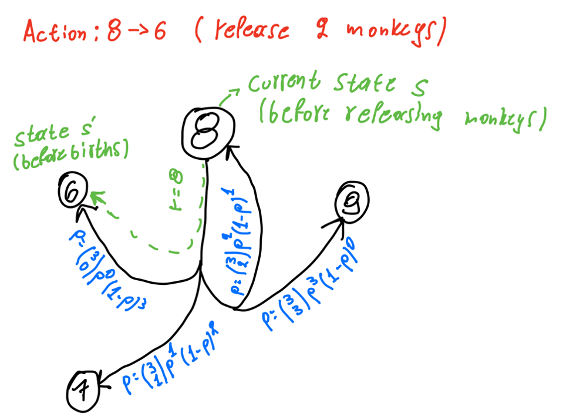

# Reinforcement Learning - Value Iteration Implementation

[](https://raw.githubusercontent.com/drkostas/RL-Value-Iteration/master/LICENSE)
<a href="https://www.buymeacoffee.com/drkostas" target="_blank"></a>

## Table of Contents

+ [About](#about)
    + [Problem Description](#description)
    + [Code Description](#code)
+ [Install the requirements](#install)
+ [Run the Experiment](#run)
+ [License](#license)

## About <a name = "about"></a>

Implementation of value iteration algorithm for calculating an optimal MDP policy. 

### Problem Description <a name = "description"></a>

The goal is to find an optimal policy for a zoo to maintain the population of monkeys at the zoo. The zoo would like to have as many monkeys possible above a certain minimum, but needs to make sure it does not grow too large. Therefore, every year they need to decide
how many monkeys will be released back into the wild.

1. The agent decides once a year how many monkeys to release.
2. The number of monkey born each year can be modeled as a random variable. The
monkeys always find a partner, and so given n monkeys, each pair of them (n/2 pairs)
has a probability p of having a child (if there is an odd number of monkeys - round
down). This probability is independent for each pair.
3. The goal is to keep the number of monkeys as high as possible between two numbers:
Nmin and Nmax.
4. Reward should be equal to the current number of monkeys in the zoo (before the
release). However, if the number is less than Nmin or greater than Nmax no reward
should be given.
5. If the number of monkeys is greater than 2 × Nmax, the zoo completely fails. Assume
that this is a terminal state with a large negative reward given Rover when entering it.

I'm defining each state as the number of monkeys and each action as the number of monkeys to release. Therefore, taking an action has to do with the number of monkeys to be released before calculating the births. Then for every action, there is a list of possible sub-actions based on the number of pairs corresponding to the target state of that action. An example is shown in the diagram below:
 


I use the binomial distribution to find the probabilities of every sub-action (sub-action is defined as the number of monkeys born). In this figure, I’m only showing the action 8->6 i.e., releasing 2 monkeys when having 8 (shown in green). With blue colors, I’m showing the equivalent sub-actions i.e., having 0, 1, 2, or 3 births and ending up to state 6, 7, 8, or 9 respectively. The reward is 8 for all those sub-actions because we use the source state to calculate it. 


### Code Description <a name = "code"></a>

There are 4 main code files: experiment.py, and plots.ipynb, run_for_thetas.sh, and run_for_gammas.sh. The first file contains the code for running the monkey-zoo experiment while the second is for plotting the results. The third and fourth files are bash scripts that run the experiment.py for different thetas or gammas and save the different execution times. The experiment’s code doesn’t rely on any external libraries, but for plotting the results I’m using NumPy, Pandas, and Matplotlib as they can be found in the requirements.txt file. The folder, outputs, is where the experiment’s results are saved to be loaded for plotting in the notebook. 

The code of experiment.py starts from the main() function, where it reads the arguments and initializes the Agent. 
The Agent is a class that contains all the required functions for the experiment. Then, I call value_iteration(). There I pick a random initial state, initialize the required variables (set the initial V[s] for every non-terminal state equal to V0), and start a while loop. The loop ends when the state exceeds 2*Nmax, the iterations exceed max_iters, or Delta becomes smaller than θ. Then I loop through all the possible states and their corresponding possible actions. In that loop, I calculate the expected return for each of those [s, a] pairs and assign them to Q(s, a). Then I assign the maximum expected return for each state to V(s). Finally, I calculated Delta for that state. 
After I loop through all the states, I select the best action for the current state using V and release the corresponding monkeys. I then calculate the number of kids that are born based on the monkeys left and add them to the new state.
The value iteration function then returns V and Q; based on that V, the optimal policy is calculated. Finally, I print and save the results.

Now I will briefly explain some of the Agent's methods.
-	get_possible_states_and_actions: Generates all possible actions and states for the arguments given
-	value_iteration(): Runs the value iteration based on the theory
-	initialize_V(): Initialize V
-	get_expected_return(): Calculates the expected return for the desired state and action get_sub_actions_and_probabilities(): Given the current s’ (target state after removing a monkeys), it calculates all the possible sub-actions (action that adds the births) and the equivalent probabilities to be used in get_expected_return()
-	calculate_reward(): Calculates the reward using the current state to be used in get_expected_return()
-	get_best_action: Calculate the best action given a state and the current state value function
-	calculate_policy(): Calculate the policy based on the current V
-	calculate_kids(): Given the number of monkeys, calculate the number of pairs, and for each of them add a kid if p (different for each pair) is larger or equal to a generated random uniform number.
-	should_terminate(): Check if the while loop in the value iteration should break


## Install the requirements <a name = "install"></a>

First, you need to create a virtual environment and activate it:
```ShellSession
$ conda deactivate
$ conda create -n <env_name> python=3.8
$ conda activate <env_name>
```
Then, install the requirements:
```ShellSession
conda install --file requirements.txt
```

## Run the Code <a name = "run"></a>

The experiment.py expects 5 arguments but optionally 3 additional ones can be passed. The 5 required arguments are Nmin, Nmax, p, Rover, and gamma. The 3 additional ones are max_iterations, V0, and theta with their default values set to 200, 20, and 0.01 respectively. An example of running the experiment is the following:
```ShellSession
python experiment.py 2 4 0.5 -100 0.9
```
Which uses the following parameters: Nmin: 2, Nmax: 4, p: 0.5, Rover: -100.0, gamma: 0.9 and the default values: max iters: 200, starting_V: 20, theta: 0.0.

The experiment.py will save the results in the outputs folder. The plots.ipynb will load the results from the outputs folder and plot them.

The shell scripts are used to run the experiment.py for different thetas or gammas and save the execution times. More information on how to run them can be found inside the files.

## License <a name = "license"></a>

This project is licensed under the MIT License - see the [LICENSE](LICENSE) file for details.

